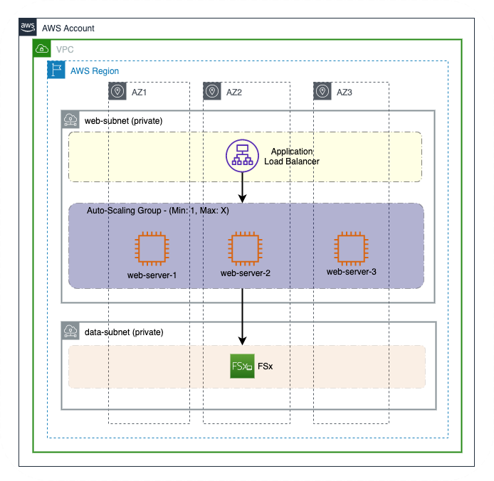
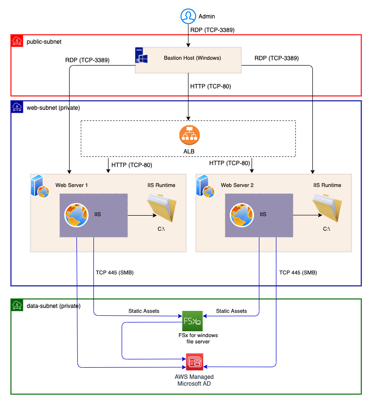

## Dynamic Website (IIS) using FSx for windows file server - Terraform quickstart code

This terraform project deployes a sample IIS web-server by storing static assets in FSx for windows file server. The code also deploys AWS Managed Microsoft AD with SSM automation document which will auto-join the web servers to windows active directory. The code utilises the default 'share' folder in the FSx to demostrate the share folder which will be used as the physical path for the IIS server. The code automatically deletes the default IIS website and creates a new sample web-site. 

### Solution Architecture
The proposed solution utilises multiple availability zones to deploy ec2 windows servers in order to accomplish high-availability for the web-servers. All Windows server will be automatically joined to windows active directory. The FSx for windows file server also will be joined to the same windows active directory which makes the shared folder administration easy. 



### Deployment Architecture of the sample code
The terraform IaC (Infrastructure as a Code) deploys the following components in order to build the sample dynamic website.
- EC2 windows instances (webserver)
- Bastion host (windows EC2)
- AWS Managed Microsoft AD
- FSx for windows file server
- VPC, Private/Public Subnets, Internet Gateway, required route tables
- VPC endpoint for S3, Secrets Manager, SSM, EC2, logs
- SSM automation document
- Route53 resolver outbound endpoint
- Auto-Scaling group and Application load balancer




### Prerequisites

#### Tools and knowledge

You should have the following installed in your machine:

* [AWS CLI](https://docs.aws.amazon.com/cli/latest/userguide/install-cliv2.html)
* [Terraform CLI](https://www.terraform.io/downloads.html)

Note: The commands below assumes that the machine used is macOS. Please adjust the commands accordingly to the Operating System of your choice.

You should also have working knowledge of:

* Terraform
* Systems Manager
* Auto-scaling groups
* Windows

### Account Setup

(Optional) Create [autoscaling service-linked role](https://docs.aws.amazon.com/autoscaling/ec2/userguide/autoscaling-service-linked-role.html#create-service-linked-role)

```bash
aws iam create-service-linked-role --aws-service-name autoscaling.amazonaws.com

# If your receive the following error, you can safely skip this step
# Service role name AWSServiceRoleForAutoScaling has been taken in this account, please try a different suffix.
```

Create an EC2 key pair

```bash
aws ec2 create-key-pair --key-name sample_key_pair --query 'KeyMaterial' --output text > sample_key_pair.pem
```

### Deploy sample code

Issue the following commands to deploy the code to target AWS account

```bash

terraform init

terraform apply -auto-approve
```

### Destroy Environment

To destroy the demo environment, issue the following command

```bash
terraform destroy -auto-approve
```

### References

* <https://aws.amazon.com/fsx/windows/>
* <https://docs.aws.amazon.com/directoryservice/latest/admin-guide/directory_microsoft_ad.html>

## Security

See [CONTRIBUTING](CONTRIBUTING.md#security-issue-notifications) for more information.

## License

This library is licensed under the MIT-0 License. See the LICENSE file.

